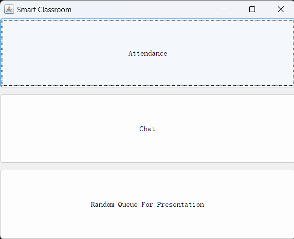
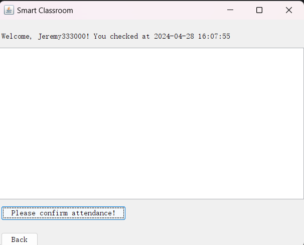
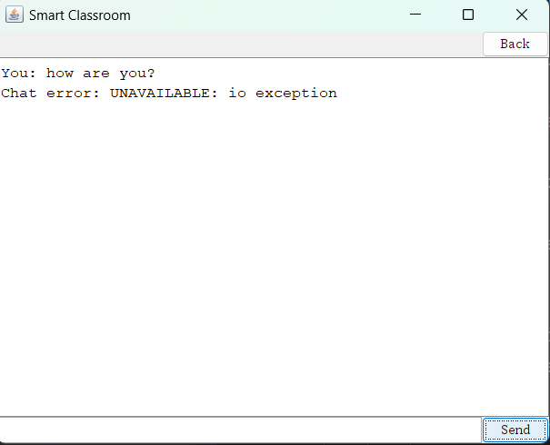
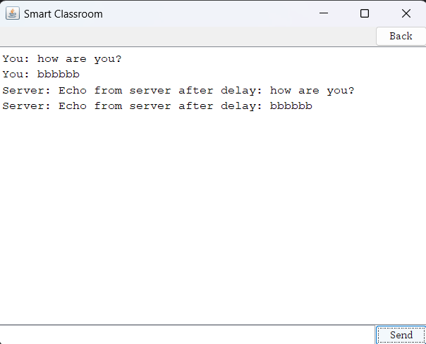
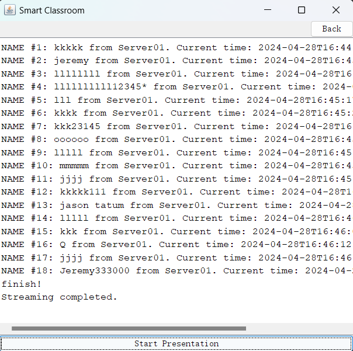
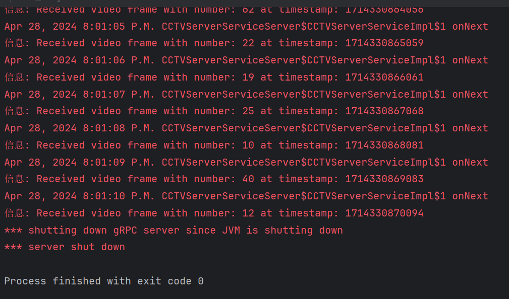
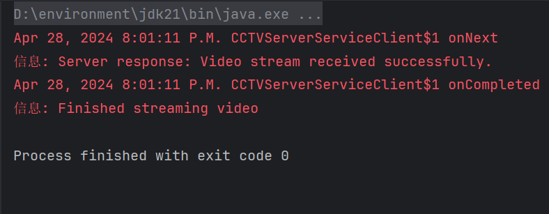

<p align="center">
  
</p>

## <center>National College of Ireland
### <center>HDip in Computing
### <center> Distributed Systems
<br>

#### <center> Domain: smart education
#### <center> Student name: Mingyan Jia
#### <center> Student number: 22239227
#### <center> HDip in Science in Computing
#### <center> Lecturer: Mark Cudden
#### <center> Academic year: 2023/24
#### <center> github repo: https://github.com/Jeremywikim/GrpcSmartClassroom.git

<br><br>
# <center> Part 1
## 1. Domain Description

For my smart classroom scenario, I have four rpc services to track students<br>
attendance(simple rpc), random arrangement of presentation(server side stream rpc),<br>
bidirectional chatting prompt(bidirectional rpc) and <br>
CCTV systems(client side stream rpc).
The overall aim of the app is designed to provide convenience for<br>
students and teachers, so that all four services I picked are very common used.

Attendance Tracking Service: <br>
Integrating with students to get student's name sent to server's recording csv<br>
file, with essential information as student name and the clocked in time <br>
(the time is server side time), so that Tutors can easily know the exact <br>
problem of attendance. (Also, I have another service based on the attended students)<br>

Chat Service: <br>
It is another common usage in class, students can easily send questions to<br>
tutor and get responses during lessons.<br>

Presentation Management Service: <br>
Managing the order of student presentations, ensuring a smooth transition between<br>
speakers and providing the instructor with control over the session flow.<br>

CCTV Service:<br>
Ensuring a safe and secure learning environment is important, and the CCTV<br>
Service plays a crucial role in achieving this objective.<br>

In my case project, attendance service is the most important one, as it not<br>
only gets the information of students' attendance but also provides <br>
presentation service basic data, in real scenario, tutors might manage random<br>
presentation during class(so the exact attended students are necessary). <br>
chat service is also playing an essential role especially in a big classroom<br>
with much more students. Lastly, CCTV service usually<br>
runs all the day (I made it simple in my case, but certainly, it ain't simple ).

## 2. Service definition and RPC

Attendance Tracking Service<br>

RPC Methods:<br>
sendUnaryRequest(unary rpc): Recording a student's attendance and return confirm.<br>
Request: AttendanceRequest contains studentName,it comes from the entering prompt.<br>
Response: AttendanceResponse includes message confirming successfuly clocked-in. <br>
in detail, it is override as "Welcome, " + clientName + "! You checked at " + <br>
formattedDate in Implementations.<br>

Presentation Service<br>

RPC Methods:  <br>      
streamServerRequest(server side stream rpc): Adding a student to the presentation queue.<br>
Request: PresentationRequest specifies the sessionDate.<br>
Response: PresentationList provides a list of students and the exact time of server.<br>


Chat Service<br>

RPC Methods:<br>
LiveSession (bidirectional): Sending and receiving stream messages between user and server.<br>
Request: ClassroomMessage includes user(name), message,timestamp.<br>
Response: MessageResponse confirms the message delivery with status.<br>

CCTV Service<br>

RPC Methods:<br>
StreamVideo (client side stream rpc): Sending stream from client to server.<br>
Request: VideoFrame includes number (simulating images) and timestamp.<br>
Response: StreamVideoResponse confirms that video is transferred successfully.<br>

## 3. Service Implementations

<br>
<p align="center">
  
</p>

This is the first page of GUI dashboard, There are three services available on it.<br>

### 3.1 Attendance service (unary rpc)
#### 3.1.1 Demonstration
Clicking on the button, it goes to attendance panel, showing as below.
<p align="center">
  
</p>

At the above part there is a text area showing "please enter your name",middle <br>
part is enter prompt that allows students enter their name, then click on the<br>
confirm button, the name will be sent to the server. and saved in a csv file, <br>
also, confirm information will be response to the client. like image below.<br><br>

<p align="center">
  
</p>

####  **3.1.2 Error Handling and logic correction**
1. If the server is not available, the notification will be "UNAVAILABLE: io exception"<br>
and the system can still be running, once server is available, response can be received.<br>

2. After a name is entered to the prompt and confirm button is clicked, the prompt is<br>
cleared so that next name can be entered directly. also, when users get back to first<br>
page and go to attendance page again, all the previous data got cleared.<br>

3. In the server side, when a name is received, the server will always check if <br>
".csv" file is existing. If it is, the name will be saved in the file plus the exact<br>
time. It keeps the server service stronger.
<br><br>
### 3.2 Chat service (bidirectional stream rpc)
#### 3.2.1 Demonstration

<p align="center">
  
</p>

1. As shown in the image, once server is not available, error is shown.

<p align="center">
  
</p>

2. It Successfully gets response from server.
3. when it gets to first page and gets back, the words is saved (referred to social app).
4. I have 5 seconds delay after receive the request as it demonstrates non-block stream<br>
in bidirectional rpc.

<br><br>
### 3.3 Presentation service (server side stream rpc)
#### 3.3.1 Demonstration
<p align="center">
  
</p>

1. The student name will be printed one by one on the dash until no names in csv file available.


####  **3.3.2 Error Handling and logic correction**
1. Handling the header of csv file, keeping it from sent to client.
2. Determining how many names left in order to forbid INDEX OUT BOUNDARY ERROR.

### 3.4 CCTV service (Client side stream rpc)
#### 3.4.1 Demonstration
<p align="center">
  
</p>
<p align="center">
  
</p>

1. As shown in the images, when the stream of data has been sent to the server, <br>
    the server sent a response to client (Video stream received successfully.), then the <br>
    onCompleted function was triggered and the client just shut down.<br>
    Here is the stack flow:<br><br>

    Client-side Stream Completion: <br>
    In CCTVServerServiceClient, the shutdown process is initiated after the client completes <br>
    its interaction, with calling the onCompleted() <br>
    method on the StreamObserver that is used to send messages to the server. <br>
    This tells server that the client has finished sending all its data.<br><br>

    Waiting for Server Response:<br>
    After telling server the completion with onCompleted(), the client still needs to ensure that<br>
    receive responses from the server.<br><br>
    
    Finish Latch: <br>
    The client uses a CountDownLatch to wait for the server's final response. <br>
    The onCompleted() method from the server's response observer will decrement this latch, <br>
    which allows the client to shut down only after the server <br>
    has also signaled that it has completed the interaction.<br><br>
    
    Shutdown Call: <br>
    Once all responses are received and the interaction is fully completed<br>,
    the client then shuts down<br><br>

   2. On server side:

    Server-side Stream Handling:
    The handling of the stream can be<br>
    set to shut down the server once the streaming  completes. <br>
    
    StreamObserver Implementation: 
    In the server implementation, when the server's StreamObserver's onCompleted() method<br>
    is called by the client-side, the server can handle this by sending a final message back to<br>
    the client and then invoking its own shutdown procedures.<br><br>
    
    Immediate Shutdown:
    The server can implement a shutdown directly in the onCompleted() handling of<br>
    the StreamObserver, which will shut down the server as soon as the client tells server <br>
    that no more data will be sent. This is a forced shutdown that occurs right after<br>
    the current client-server interaction ends.<br><br>


# <center> Part 2   backup
```java
import com.mingyan.smartClassroom.CCTVService.*;
import io.grpc.Server;
import io.grpc.ServerBuilder;
import io.grpc.stub.StreamObserver;
import java.io.IOException;
import java.util.concurrent.TimeUnit;
import java.util.logging.Logger;

/**
 * Server to interact with the CCTV client using gRPC.
 * Connection to the client,
 * Receiving video frames, and handling request.
 */
public class CCTVServerServiceServer {

    private static final Logger logger = Logger.getLogger(CCTVServerServiceServer.class.getName());

    private Server server;

    /**
     * Starts the gRPC server.
     * throws IOException if there is an error starting the server.
     */
    private void start() throws IOException {
        int port = 20000; // Initialize and start the server on the specified port
        server = ServerBuilder.forPort(port)
                .addService(new CCTVServerServiceImpl())
                .build()
                .start();
        logger.info("CCTV Server started, listening on " + port);

        // Add a shutdown hook to ensure clean shutdown including freeing port and other resources
        Runtime.getRuntime().addShutdownHook(new Thread(() -> {
            System.err.println("*** shutting down gRPC server since JVM is shutting down");
            try {
                CCTVServerServiceServer.this.stop();
            } catch (InterruptedException e) {
                e.printStackTrace(System.err);
            }
            System.err.println("*** server shut down");
        }));
    }

    /**
     * Stops the server and waits for it to shut down completely within a timeout.
     */
    private void stop() throws InterruptedException {
        if (server != null) {
            server.shutdown().awaitTermination(30, TimeUnit.SECONDS); // 30s
        }
    }

    /**
     * Blocks until the server shuts down.
     * throws InterruptedException if the thread is interrupted while waiting.
     */
    private void blockUntilShutdown() throws InterruptedException {
        if (server != null) {
            server.awaitTermination();
        }
    }

    /**
     * Implements the server-side logic for the CCTV service.
     */
    class CCTVServerServiceImpl extends CCTVServerServiceGrpc.CCTVServerServiceImplBase {

        /**
         * Handles incoming video frame streams from clients.
         * return a stream observer to handle the client's video frame stream.
         */
        @Override
        public StreamObserver<VideoFrame> streamVideo(StreamObserver<StreamVideoResponse> responseObserver) {
            return new StreamObserver<VideoFrame>() {
                @Override
                public void onNext(VideoFrame videoFrame) {
                    // Log each received video frame
                    logger.info("Received video frame with number: " + videoFrame.getNumber() + " at timestamp: " + videoFrame.getTimestamp());
                }

                @Override
                public void onError(Throwable t) {
                    // Log any errors encountered during the stream
                    logger.warning("StreamVideo encountered error: " + t);
                }

                @Override
                public void onCompleted() {
                    // Send a completion message back to the client
                    StreamVideoResponse response = StreamVideoResponse.newBuilder()
                            .setMessage("Video stream received successfully.")
                            .build();
                    responseObserver.onNext(response);
                    responseObserver.onCompleted();

                    // Trigger server shutdown here
                    try {
                        CCTVServerServiceServer.this.stop();
                    } catch (InterruptedException e) {
                        e.printStackTrace();
                    }
                }
            };
        }
    }

    /**
     * Main method to run the server.
     */
    public static void main(String[] args) throws IOException, InterruptedException {
        final CCTVServerServiceServer server = new CCTVServerServiceServer();
        server.start();
        server.blockUntilShutdown();
    }
}

```
```java
import com.mingyan.smartClassroom.CCTVService.*;
import io.grpc.ManagedChannel;
import io.grpc.ManagedChannelBuilder;
import io.grpc.stub.StreamObserver;
import java.util.concurrent.CountDownLatch;
import java.util.concurrent.TimeUnit;
import java.util.logging.Logger;

/**
 * Client to interact with the CCTV service using gRPC.
 * This class is responsible for establishing a connection to the server,
 * sending video frames, and handling server responses.
 */
public class CCTVServerServiceClient {
    private static final Logger logger = Logger.getLogger(CCTVServerServiceClient.class.getName());
    private final ManagedChannel channel; // Channel for making remote calls
    private final CCTVServerServiceGrpc.CCTVServerServiceStub asyncStub; // Asynchronous stub for making non-blocking calls

    /**
     * Constructs a client for accessing the server at the given host and port.
     */
    public CCTVServerServiceClient(String host, int port) {
        this(ManagedChannelBuilder.forAddress(host, port)
                .usePlaintext() // Configure the channel to not use SSL/TLS to allow unencrypted communication
                .build());
    }

    /**
     * Constructs a client for accessing a pre-configured channel.
     */
    CCTVServerServiceClient(ManagedChannel channel) {
        this.channel = channel;
        asyncStub = CCTVServerServiceGrpc.newStub(channel);
    }

    /**
     * Shuts down the channel gracefully.
     */
    public void shutdown() throws InterruptedException {
        channel.shutdown().awaitTermination(5, TimeUnit.SECONDS);
    }

    /**
     * Async client-side streaming call to send video frames to the server.
     * This method prepares a latch to handle the asynchronous completion of the video stream.
     */
    public void streamVideo() throws InterruptedException {
        final CountDownLatch finishLatch = new CountDownLatch(1);
        StreamObserver<StreamVideoResponse> responseObserver = new StreamObserver<StreamVideoResponse>() {
            @Override
            public void onNext(StreamVideoResponse response) {
                logger.info("Server response: " + response.getMessage());
            }

            @Override
            public void onError(Throwable t) {
                logger.warning("StreamVideo failed: " + t);
                finishLatch.countDown();
            }

            @Override
            public void onCompleted() {
                logger.info("Finished streaming video");
                finishLatch.countDown();
            }
        };

        StreamObserver<VideoFrame> requestObserver = asyncStub.streamVideo(responseObserver);
        try {
            // Simulate streaming video data
            for (int i = 0; i < 10; i++) {
                long timestamp = System.currentTimeMillis();
                VideoFrame videoFrame = VideoFrame.newBuilder()
                        .setNumber((int) (Math.random() * 100))
                        .setTimestamp(timestamp)
                        .build();
                requestObserver.onNext(videoFrame);
                // Sleep for demonstration purposes
                Thread.sleep(1000);
            }
        } catch (RuntimeException e) {
            requestObserver.onError(e);
            throw e;
        }
        // Mark the end of requests
        requestObserver.onCompleted();

        // Wait for the server to respond or error before finishing the client.
        finishLatch.await(1, TimeUnit.MINUTES);
    }

    /**
     * Main method to run the client.
     * It creates an instance of the client, starts video streaming, and finally shuts down the client.
     */
    public static void main(String[] args) throws InterruptedException {
        CCTVServerServiceClient client = new CCTVServerServiceClient("localhost", 20000);
        try {
            client.streamVideo();
        } finally {
            client.shutdown();
        }
    }
}
```

```java
import com.mingyan.smartClassroom.attendanceTrackingService.*;
import io.grpc.Server;
import io.grpc.ServerBuilder;
import io.grpc.stub.StreamObserver;

import java.io.*;
import java.nio.file.StandardOpenOption;
import java.time.format.DateTimeFormatter;
import java.util.ArrayList;
import java.util.HashSet;
import java.util.List;
import java.util.Set;
import java.util.concurrent.TimeUnit;
import java.time.LocalDateTime;

import java.io.IOException;
import java.nio.file.Files;
import java.nio.file.Paths;
import java.util.concurrent.atomic.AtomicBoolean;
import java.util.concurrent.atomic.AtomicInteger;
import java.util.logging.Logger;


public class AttendanceServerServiceServer extends StreamingServerServiceGrpc.StreamingServerServiceImplBase {

    static final Logger logger = Logger.getLogger(AttendanceServerServiceServer.class.getName());
    /**
    * override send sendUnaryRequest to have some customized features
    * formattedDate is the time when client sends name to the server,
    * the server will respond '"Welcome, " + clientName + "! You checked at " + formattedDate'
    * also, the server saves the clientName, formattedDate information from each request.
     */
    @Override
    public void sendUnaryRequest(AttendanceRequest request, StreamObserver<AttendanceResponse> responseObserver) {
        String clientName = request.getName();
        // Get the current time
        LocalDateTime now = LocalDateTime.now();
        // Format it to a readable form
        DateTimeFormatter formatter = DateTimeFormatter.ofPattern("yyyy-MM-dd HH:mm:ss");
        String formattedDate = now.format(formatter);
        String message = "Welcome, " + clientName + "! You checked at " + formattedDate;
        AttendanceResponse response = AttendanceResponse.newBuilder()
                .setMessage(message)
                .build();
        responseObserver.onNext(response);
        responseObserver.onCompleted();

        // Save to CSV
        saveAttendanceRecord(clientName, formattedDate);
    }


    /**
     * Streams random client names from a CSV file back to the client every 5 seconds,
     * finishing when all names have been sent.
     */
    @Override
    public void streamServerRequest(StreamServerRequest request, StreamObserver<StreamServerResponse> responseObserver) {
        String serverName = request.getServerName();
        List<String> clientNames = new ArrayList<>();
        // Load client names from CSV, skipping the first line
        try (BufferedReader reader = new BufferedReader(new FileReader("attendance_records.csv"))) {
            String line;
            boolean firstLine = true;
            while ((line = reader.readLine()) != null) {
                if (firstLine) {
                    firstLine = false; // Skip the first line (titles)
                    continue;
                }
                clientNames.add(line.split(",")[0]); // Assuming the name is the first column
            }
        } catch (IOException e) {
            e.printStackTrace();
        }

        AtomicBoolean finished = new AtomicBoolean(false);
        AtomicInteger nameCounter = new AtomicInteger(1); // Counter for names

        Runnable streamingTask = () -> {
            try {
                while (!Thread.currentThread().isInterrupted() && !finished.get()) {
                    if (clientNames.isEmpty()) {
                        responseObserver.onNext(StreamServerResponse.newBuilder()
                                .setMessage("finish!")
                                .build());
                        finished.set(true);
                    } else {
                        // Pick a random name from the list
                        int index = (int) (Math.random() * clientNames.size());
                        String name = clientNames.get(index);
                        clientNames.remove(index); // Remove the name to avoid resending

                        String message = "NAME #" + nameCounter.getAndIncrement() + ": " + name +
                                " from " + serverName + ". Current time: " + LocalDateTime.now();
//                        String message = "Message #" + nameCounter.getAndIncrement() + ": " + name +
//                                " from " + serverName + ". Current time: " + LocalDateTime.now();

                        responseObserver.onNext(StreamServerResponse.newBuilder()
                                .setMessage(message)
                                .build());
                    }
                    Thread.sleep(5000); // Stream every 5 seconds
                }
            } catch (InterruptedException e) {
                Thread.currentThread().interrupt();
            } finally {
                responseObserver.onCompleted();
            }
        };

        Thread streamingThread = new Thread(streamingTask);
        streamingThread.start();
    }


//    @Override
//    public void streamServerRequest(StreamServerRequest request, StreamObserver<StreamServerResponse> responseObserver) {
//        String serverName = request.getServerName();
//        Runnable streamingTask = () -> {
//            try {
//                while (!Thread.currentThread().isInterrupted()) {
//                    String message = "This is a message from the server: " + serverName + ". Current time: " + LocalDateTime.now();
//                    StreamServerResponse response = StreamServerResponse.newBuilder()
//                            .setMessage(message)
//                            .build();
//                    responseObserver.onNext(response);
//                    Thread.sleep(5000); // Stream every 5 seconds
//                }
//            } catch (InterruptedException e) {
//                Thread.currentThread().interrupt();
//            } finally {
//                responseObserver.onCompleted();
//            }
//        };
//
//        Thread streamingThread = new Thread(streamingTask);
//        streamingThread.start();
//    }


    /**
    * The method appends each client's name and check-in time to a CSV file.
    * It uses BufferedWriter and handles potential I/O exceptions.
    * The method is marked synchronized to prevent concurrent modifications
    *  of the file from multiple threads, which might corrupt the file.
     */
    private synchronized void saveAttendanceRecord(String clientName, String date) {
        try (BufferedWriter bw = Files.newBufferedWriter(Paths.get("attendance_records.csv"), StandardOpenOption.CREATE, StandardOpenOption.APPEND)) {
            bw.write(clientName + "," + date);
            bw.newLine();
        } catch (IOException e) {
            System.err.println("Failed to write to CSV: " + e.getMessage());
        }
    }

    /**
    * initCSV()
    * When the server starts, it checks if the CSV file exists. If not, it creates the file
    * and writes a header row. This ensures that data fields are properly labeled and organized.
     */
    private static void initCSV() throws IOException {
        if (!Files.exists(Paths.get("attendance_records.csv"))) {
            try (BufferedWriter bw = Files.newBufferedWriter(Paths.get("attendance_records.csv"))) {
                bw.write("ClientName,FormattedDate");
                bw.newLine();
            }
        }
    }


    public static void main(String[] args) throws IOException, InterruptedException {
        // // Ensure the CSV file exists and has a header
        initCSV();
        AttendanceServerServiceServer server = new AttendanceServerServiceServer();
        Server grpcServer = ServerBuilder.forPort(8080)
                .addService(server)
                .build();

        grpcServer.start();
//        System.out.println("Attendance Server started, listening on port 8080\n");
        logger.info("Attendance Server started, listening on port 8080\n");

        // Graceful shutdown
        Runtime.getRuntime().addShutdownHook(new Thread(() -> {
            System.out.println("Shutting down gRPC server");
            try {
                grpcServer.shutdown().awaitTermination(30, TimeUnit.SECONDS);
            } catch (InterruptedException e) {
                e.printStackTrace(System.err);
            }
        }));

        grpcServer.awaitTermination();
    }
}
```
```java
import com.mingyan.smartClassroom.attendanceTrackingService.*;
import io.grpc.ManagedChannel;
import io.grpc.ManagedChannelBuilder;
import io.grpc.stub.StreamObserver;

import java.util.Scanner;
import java.util.concurrent.TimeUnit;

public class AttendanceServerServiceClient {

    private final ManagedChannel channel;
    private final StreamingServerServiceGrpc.StreamingServerServiceStub stub;

    /**
     * AttendanceServerServiceClient to send request to server
     */
    public AttendanceServerServiceClient(String host, int port) {
        this.channel = ManagedChannelBuilder.forAddress(host, port)
                .usePlaintext()
                .build();
        this.stub = StreamingServerServiceGrpc.newStub(channel);
    }

//    public void sendUnaryRequest(String name) {
//        AttendanceRequest request = AttendanceRequest.newBuilder()
//                .setName(name)
//                .build();
//        stub.sendUnaryRequest(request, new StreamObserver<AttendanceResponse>() {
//            @Override
//            public void onNext(AttendanceResponse response) {
//                System.out.println("Unary response from server: " + response.getMessage());
//            }
//
//            @Override
//            public void onError(Throwable t) {
//                System.err.println("Error in unary request: " + t.getMessage());
//            }
//
//            @Override
//            public void onCompleted() {
//                System.out.println("Unary request completed");
//            }
//        });
//    }


    /**
    * sendUnaryRequest is used to send a Unary Request to server with two parameters.
    * name is to container of name of student, responseObserver is container to contain
    * the information of response of server
     */
    public void sendUnaryRequest(String name, StreamObserver<AttendanceResponse> responseObserver) {
        AttendanceRequest request = AttendanceRequest.newBuilder()
                .setName(name)
                .build();
        stub.sendUnaryRequest(request, responseObserver);  // Use the passed StreamObserver directly
    }


    /**
    * streamServerRequest is to send request to server
     * and get stream response
     */

    public void streamServerRequest(StreamObserver<StreamServerResponse> responseObserver) {
        StreamServerRequest request = StreamServerRequest.newBuilder()
                .setServerName("Server01")
                .build();
        stub.streamServerRequest(request, responseObserver);
    }


//    public void streamServerRequest() {
//        StreamObserver<StreamServerResponse> responseObserver = new StreamObserver<StreamServerResponse>() {
//            @Override
//            public void onNext(StreamServerResponse response) {
//                System.out.println("Server message: " + response.getMessage());
//            }
//
//            @Override
//            public void onError(Throwable t) {
//                System.err.println("Error in server streaming: " + t.getMessage());
//            }
//
//            @Override
//            public void onCompleted() {
//                System.out.println("Server streaming completed");
//            }
//        };
//
//        stub.streamServerRequest(StreamServerRequest.newBuilder().setServerName("Server01").build(), responseObserver);
//    }


    /**
    * for the test (before I change the parameter of sendUnaryRequest ), this main function went well
    * the same for streamServerRequest().
     */
    public static void main(String[] args) {
        AttendanceServerServiceClient client = new AttendanceServerServiceClient("localhost", 8080);
//        client.sendUnaryRequest("Client01");
//        client.streamServerRequest();

        Scanner scanner = new Scanner(System.in);
        while (true) {
            System.out.println("Press 'Q' to quit");
            String input = scanner.nextLine();
            if (input.equalsIgnoreCase("Q")) {
                client.shutdown();
                break;
            }
        }
    }

    /**
    * shutdown is used to shut down the client, ACTUALLY, only between the test, I use it to
    * shut down the client (just run the main function), I keep it here maybe it is useful in future.
     */
    public void shutdown() {
        try {
            channel.shutdown().awaitTermination(5, TimeUnit.SECONDS);
        } catch (InterruptedException e) {
            System.err.println("Error while shutting down client: " + e.getMessage());
        }
    }
}
```
```java
import com.mingyan.smartClassroom.CCTVService.*;
import io.grpc.Server;
import io.grpc.ServerBuilder;
import io.grpc.stub.StreamObserver;
import java.io.IOException;
import java.util.concurrent.TimeUnit;
import java.util.logging.Logger;

/**
 * Server to interact with the CCTV client using gRPC.
 * Connection to the client,
 * Receiving video frames, and handling request.
 */
public class CCTVServerServiceServer {

    private static final Logger logger = Logger.getLogger(CCTVServerServiceServer.class.getName());

    private Server server;

    /**
     * Starts the gRPC server.
     * throws IOException if there is an error starting the server.
     */
    private void start() throws IOException {
        int port = 20000; // Initialize and start the server on the specified port
        server = ServerBuilder.forPort(port)
                .addService(new CCTVServerServiceImpl())
                .build()
                .start();
        logger.info("CCTV Server started, listening on " + port);

        // Add a shutdown hook to ensure clean shutdown including freeing port and other resources
        Runtime.getRuntime().addShutdownHook(new Thread(() -> {
            System.err.println("*** shutting down gRPC server since JVM is shutting down");
            try {
                CCTVServerServiceServer.this.stop();
            } catch (InterruptedException e) {
                e.printStackTrace(System.err);
            }
            System.err.println("*** server shut down");
        }));
    }

    /**
     * Stops the server and waits for it to shut down completely within a timeout.
     */
    private void stop() throws InterruptedException {
        if (server != null) {
            server.shutdown().awaitTermination(30, TimeUnit.SECONDS); // 30s
        }
    }

    /**
     * Blocks until the server shuts down.
     * throws InterruptedException if the thread is interrupted while waiting.
     */
    private void blockUntilShutdown() throws InterruptedException {
        if (server != null) {
            server.awaitTermination();
        }
    }

    /**
     * Implements the server-side logic for the CCTV service.
     */
    class CCTVServerServiceImpl extends CCTVServerServiceGrpc.CCTVServerServiceImplBase {

        /**
         * Handles incoming video frame streams from clients.
         * return a stream observer to handle the client's video frame stream.
         */
        @Override
        public StreamObserver<VideoFrame> streamVideo(StreamObserver<StreamVideoResponse> responseObserver) {
            return new StreamObserver<VideoFrame>() {
                @Override
                public void onNext(VideoFrame videoFrame) {
                    // Log each received video frame
                    logger.info("Received video frame with number: " + videoFrame.getNumber() + " at timestamp: " + videoFrame.getTimestamp());
                }

                @Override
                public void onError(Throwable t) {
                    // Log any errors encountered during the stream
                    logger.warning("StreamVideo encountered error: " + t);
                }

                @Override
                public void onCompleted() {
                    // Send a completion message back to the client
                    StreamVideoResponse response = StreamVideoResponse.newBuilder()
                            .setMessage("Video stream received successfully.")
                            .build();
                    responseObserver.onNext(response);
                    responseObserver.onCompleted();

                    // Trigger server shutdown here
                    try {
                        CCTVServerServiceServer.this.stop();
                    } catch (InterruptedException e) {
                        e.printStackTrace();
                    }
                }
            };
        }
    }

    /**
     * Main method to run the server.
     */
    public static void main(String[] args) throws IOException, InterruptedException {
        final CCTVServerServiceServer server = new CCTVServerServiceServer();
        server.start();
        server.blockUntilShutdown();
    }
}
```
```java
import com.mingyan.smartClassroom.CCTVService.*;
import io.grpc.ManagedChannel;
import io.grpc.ManagedChannelBuilder;
import io.grpc.stub.StreamObserver;
import java.util.concurrent.CountDownLatch;
import java.util.concurrent.TimeUnit;
import java.util.logging.Logger;

/**
 * Client to interact with the CCTV service using gRPC.
 * This class is responsible for establishing a connection to the server,
 * sending video frames, and handling server responses.
 */
public class CCTVServerServiceClient {
    private static final Logger logger = Logger.getLogger(CCTVServerServiceClient.class.getName());
    private final ManagedChannel channel; // Channel for making remote calls
    private final CCTVServerServiceGrpc.CCTVServerServiceStub asyncStub; // Asynchronous stub for making non-blocking calls

    /**
     * Constructs a client for accessing the server at the given host and port.
     */
    public CCTVServerServiceClient(String host, int port) {
        this(ManagedChannelBuilder.forAddress(host, port)
                .usePlaintext() // Configure the channel to not use SSL/TLS to allow unencrypted communication
                .build());
    }

    /**
     * Constructs a client for accessing a pre-configured channel.
     */
    CCTVServerServiceClient(ManagedChannel channel) {
        this.channel = channel;
        asyncStub = CCTVServerServiceGrpc.newStub(channel);
    }

    /**
     * Shuts down the channel gracefully.
     */
    public void shutdown() throws InterruptedException {
        channel.shutdown().awaitTermination(5, TimeUnit.SECONDS);
    }

    /**
     * Async client-side streaming call to send video frames to the server.
     * This method prepares a latch to handle the asynchronous completion of the video stream.
     */
    public void streamVideo() throws InterruptedException {
        final CountDownLatch finishLatch = new CountDownLatch(1);
        StreamObserver<StreamVideoResponse> responseObserver = new StreamObserver<StreamVideoResponse>() {
            @Override
            public void onNext(StreamVideoResponse response) {
                logger.info("Server response: " + response.getMessage());
            }

            @Override
            public void onError(Throwable t) {
                logger.warning("StreamVideo failed: " + t);
                finishLatch.countDown();
            }

            @Override
            public void onCompleted() {
                logger.info("Finished streaming video");
                finishLatch.countDown();
            }
        };

        StreamObserver<VideoFrame> requestObserver = asyncStub.streamVideo(responseObserver);
        try {
            // Simulate streaming video data
            for (int i = 0; i < 10; i++) {
                long timestamp = System.currentTimeMillis();
                VideoFrame videoFrame = VideoFrame.newBuilder()
                        .setNumber((int) (Math.random() * 100))
                        .setTimestamp(timestamp)
                        .build();
                requestObserver.onNext(videoFrame);
                // Sleep for demonstration purposes
                Thread.sleep(1000);
            }
        } catch (RuntimeException e) {
            requestObserver.onError(e);
            throw e;
        }
        // Mark the end of requests
        requestObserver.onCompleted();

        // Wait for the server to respond or error before finishing the client.
        finishLatch.await(1, TimeUnit.MINUTES);
    }

    /**
     * Main method to run the client.
     * It creates an instance of the client, starts video streaming, and finally shuts down the client.
     */
    public static void main(String[] args) throws InterruptedException {
        CCTVServerServiceClient client = new CCTVServerServiceClient("localhost", 20000);
        try {
            client.streamVideo();
        } finally {
            client.shutdown();
        }
    }
}
```


