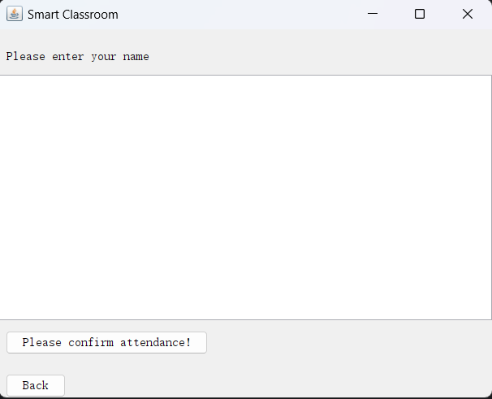

  

## 
National College of Ireland
### 
HDip in Computing
### 
 Distributed Systems
 

#### 
 Domain: smart education
#### 
 Student name: Mingyan Jia
#### 
 Student number: 22239227
#### 
 HDip in Science in Computing
#### 
 Lecturer: Mark Cudden
#### 
 Academic year: 2023/24

# 
 Part 1
## 1. Domain Description

For my smart classroom scenario, I have four rpc services to track students attendance(simple rpc),  
random arrangement of presentation(server side stream rpc),bidirectional chatting prompt(bidirectional rpc)
and CCTV systems(client side stream rpc). The overall aim of the app is designed to provide convenience for 
students and teachers, so that all four services I picked are very common used.

Attendance Tracking Service:  
Integrating with students to get student's name sent to server's recording csv file, with essential 
information as student name and the clocked in time (the time is server side time), so that Tutors can 
easily know the exact problem of attendance. (Also, I have another service based on the attended students) 

Chat Service:  
It is another common usage in class, students can easily send questions to tutor and get responses during lessons. 

Presentation Management Service:  
Managing the order of student presentations, ensuring a smooth transition between speakers and providing the 
instructor with control over the session flow. 

CCTV Service: 
Ensuring a safe and secure learning environment is important, and the CCTV Service plays 
a crucial role in achieving this objective. 

In my case project, attendance service is the most important one, as it not only gets the information 
of students' attendance but also provides presentation service basic data, in real scenario, tutors might 
manage random presentation during class(so the exact attended students are necessary). chat service is also playing 
an essential role especially in a big classroom with much more students. Lastly, CCTV service usually 
runs all the day (I made it simple in my case, but certainly, it ain't simple ).

## 2. Service definition and RPC

Attendance Tracking Service

    RPC Methods:
        sendUnaryRequest(unary rpc): Recording a student's attendance and return confirm.
            Request: AttendanceRequest contains studentName,it comes from the entering prompt.
            Response: AttendanceResponse includes message confirming successfuly clocked-in. in detail,
            it is override as "Welcome, " + clientName + "! You checked at " + formattedDate in Implementations.

Presentation Service

    RPC Methods:        
            streamServerRequest(server side stream rpc): Adding a student to the presentation queue.
                Request: PresentationRequest specifies the sessionDate.
                Response: PresentationList provides a list of students and the exact time of server.

Chat Service

    RPC Methods:
        LiveSession (bidirectional): Sending and receiving stream messages between user and server.
            Request: ClassroomMessage includes user(name), message,timestamp.
            Response: MessageResponse confirms the message delivery with status.

CCTV Service

    RPC Methods:
        StreamVideo (client side stream rpc): Sending stream from client to server.
            Request: VideoFrame includes number (simulating images) and timestamp.
            Response: StreamVideoResponse confirms that vedio is transfered successfuly.

## 3. Service Implementations

 

  

This is the first page of GUI dashboard, There are three services available on it. 

### 3.1 Attendance service (unary rpc)
#### 3.1.1 Demonstration
Clicking on the button, it goes to attendance panel, showing as below.

  

At the above part there is a text area showing "please enter your name",middle part is enter prompt 
that allows students enter their name, then click on the confirm button, the name will be sent to the server. 
and saved in a csv file, also, confirm information will be response to the client. like image below.

  

####  **3.1.2 Error Handling and logic correction**
1. If the server is not available, the notification will be "UNAVAILABLE: io exception" and 
the system can still be running, once server is available, response can be received.

2. After a name is entered to the prompt and confirm button is clicked, the prompt is cleared 
so that next name can be entered directly. also, when users get back to first page and go to attendance page 
page again, all the previous data got cleared.

3. In the server side, when a name is received, the server will always check if ".csv" file is existing. 
If it is, the name will be saved in the file plus the exact time. It keeps the server service stronger.
  
### 3.2 Chat service (bidirectional stream rpc)
#### 3.2.1 Demonstration

  

1. As shown in the image, once server is not available, error is shown.

  

2. It Successfully gets response from server.
3. when it gets to first page and gets back, the words is saved (referred to social app).
4. I have 5 seconds delay after receive the request as it demonstrates non-block stream 
in bidirectional rpc.

  
### 3.3 Presentation service (server side stream rpc)
#### 3.3.1 Demonstration

  

1. The student name will be printed one by one on the dash until no names in csv file available.

####  **3.3.2 Error Handling and logic correction**
1. Handling the header of csv file, keeping it from sent to client.
2. Determining how many names left in order to forbid INDEX OUT BOUNDARY ERROR.

### 3.4 CCTV service (Client side stream rpc)
#### 3.4.1 Demonstration

  

  

1. In client, I use random number and time to simulate video data.  
and "(int i = 0; i < 10; i++)" to simulate the size of video.
2. when All data has been sent to the server, the response will be sent to client.

## 4. Service Implementations
